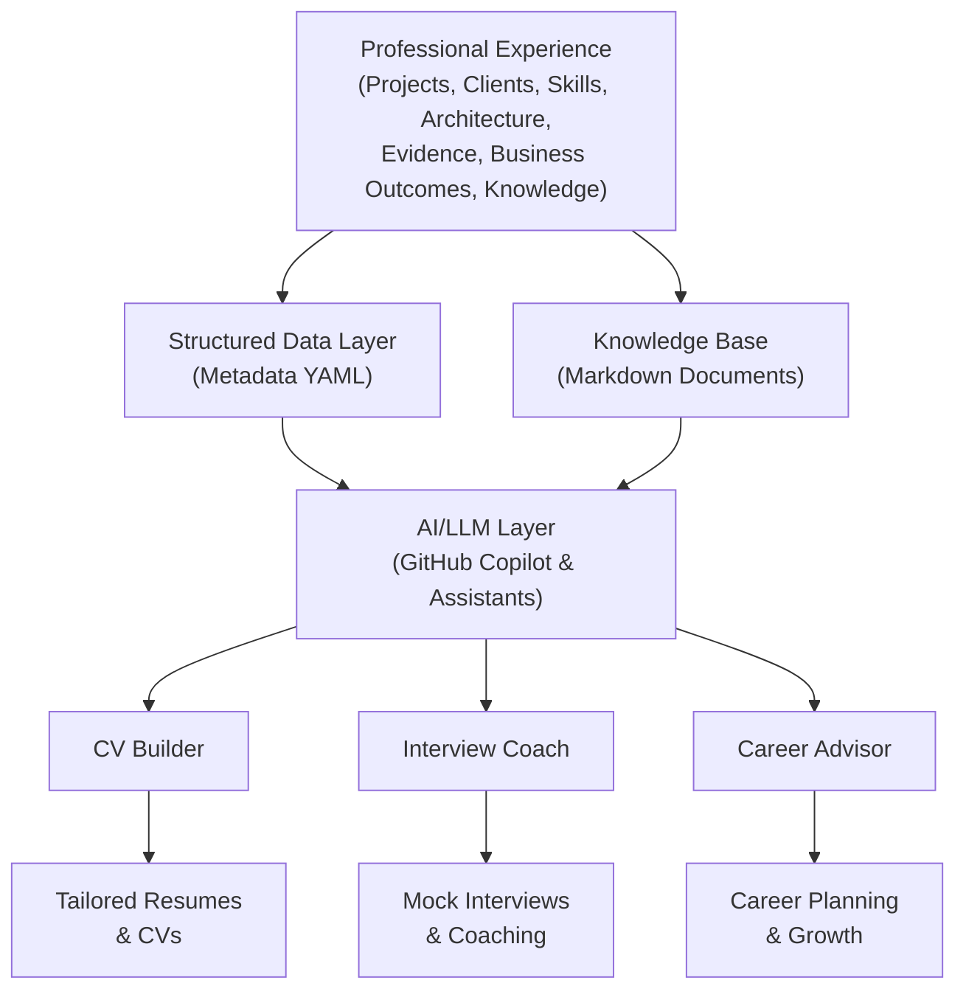

# Professional Second Brain

A private, structured knowledge repository designed to capture, organize, preserve, and make searchable my professional experience, technical skills, and career achievements.

## Purpose

This repository serves as my **authoritative source of truth** for:

- Professional experience and career history
- Technical skills and engineering knowledge
- Projects and client engagements
- Business use cases and outcomes
- Architecture experience and design decisions
- Technical achievements and leadership experience
- Interview preparation materials
- Learning journey and certifications
- AI/GenAI and cloud platform expertise
- Career goals and professional development

The repository is designed to be used by AI assistants (GitHub Copilot, etc.) as my professional knowledge base for:

- **CV Generation**: Tailored resumes for specific roles
- **Interview Coaching**: Personalized preparation and mock interviews
- **Career Analysis**: Gap analysis and skill development planning
- **Architecture Collaboration**: Reference patterns and design decisions

## Core Principles

### 🎯 Source of Truth
Every claim about professional experience must be documented and evidence-backed. AI-generated content is never treated as fact.

### 📋 Evidence First
Professional capabilities are supported by structured evidence: projects, metrics, business outcomes, and documentation.

### 🚫 No Fabrication
- No invented projects, clients, or technologies
- No exaggerated years of experience
- No conversion of learning into claimed production experience
- No ownership claims for work where only participation existed

### 🔍 Separated Classifications
Experience is strictly categorized as:
- **EXPERT**: Deep production knowledge
- **ADVANCED**: Significant hands-on experience
- **INTERMEDIATE**: Solid working knowledge
- **BEGINNER**: Foundation-level understanding
- **LEARNING**: Active study
- **EXPOSURE**: Limited exposure
- **ASPIRATION**: Future goals

### 🔐 Confidentiality First
- No client secrets, credentials, API keys, or passwords
- Anonymised client names (CLIENT_A, CLIENT_B, etc.)
- No private URLs or proprietary architecture details
- Clear confidentiality classification on all documents

## Repository Structure

```
professional-second-brain/
│
├── README.md                          # This file
├── .github/copilot-instructions.md    # AI behavior guidelines
│
├── profile/                           # Professional identity
│   ├── professional-summary.md
│   ├── career-timeline.md
│   ├── leadership.md
│   ├── skills-matrix.md
│   ├── certifications.md
│   ├── career-goals.md
│   └── skill-template.md
│
├── experience/                        # Career history
│   ├── companies/
│   ├── roles/
│   ├── responsibilities/
│   └── achievements/
│
├── projects/                          # Project portfolio (by technology)
│   ├── aws/
│   ├── terraform/
│   ├── kubernetes/
│   ├── platform-engineering/
│   ├── devops/
│   ├── devsecops/
│   ├── cicd/
│   ├── observability/
│   ├── data-engineering/
│   ├── databricks/
│   ├── ai/
│   ├── genai/
│   ├── other/
│   └── project-template.md
│
├── clients/                           # Client context (anonymised)
│   ├── client-a/
│   ├── client-b/
│   ├── client-c/
│   └── client-template.md
│
├── architecture/                      # Architecture knowledge
│   ├── reference-architectures/
│   ├── system-design/
│   ├── architecture-decisions/
│   │   └── adr-template.md
│   ├── design-patterns/
│   ├── trade-offs/
│   └── diagrams/
│
├── business/                          # Business outcomes
│   ├── use-cases/
│   ├── problem-statements/
│   ├── solution-patterns/
│   ├── business-outcomes/
│   ├── roi/
│   ├── cost-optimization/
│   └── transformation-stories/
│
├── technologies/                      # Technology knowledge base
│   ├── aws/
│   ├── azure/
│   ├── gcp/
│   ├── terraform/
│   ├── kubernetes/
│   ├── docker/
│   ├── github/
│   ├── cicd/
│   ├── observability/
│   ├── security/
│   ├── data-engineering/
│   ├── databricks/
│   ├── python/
│   ├── ai/
│   ├── genai/
│   └── other/
│
├── interview/                         # Interview preparation
│   ├── questions/
│   │   ├── aws/
│   │   ├── terraform/
│   │   ├── kubernetes/
│   │   ├── platform-engineering/
│   │   ├── devops/
│   │   ├── devsecops/
│   │   ├── data-engineering/
│   │   ├── databricks/
│   │   ├── genai/
│   │   ├── architecture/
│   │   └── leadership/
│   │   └── question-template.md
│   ├── case-studies/
│   ├── system-design/
│   ├── behavioural/
│   ├── star-stories/
│   │   └── star-template.md
│   └── mock-interviews/
│
├── evidence/                          # Achievements and metrics
│   ├── achievements/
│   │   └── achievement-template.md
│   ├── metrics/
│   ├── business-impact/
│   ├── technical-impact/
│   ├── leadership-impact/
│   └── testimonials/
│
├── knowledge/                         # Technical and business knowledge
│   ├── engineering/
│   ├── architecture/
│   ├── cloud/
│   ├── devops/
│   ├── platform-engineering/
│   ├── security/
│   ├── data/
│   ├── ai/
│   ├── genai/
│   └── business/
│
├── learning/                          # Learning and development
│   ├── roadmap.md
│   ├── certifications/
│   ├── courses/
│   ├── technologies/
│   └── research/
│
├── cv/                                # CV generation
│   ├── master/
│   ├── role-specific/
│   ├── executive/
│   └── templates/
│
├── prompts/                           # AI prompt library
│   ├── cv/
│   │   ├── build-cv.md
│   │   ├── job-match.md
│   │   └── cv-gap-analysis.md
│   ├── interview/
│   │   ├── interview-coach.md
│   │   ├── mock-interview.md
│   │   └── star-story-builder.md
│   ├── architecture/
│   │   ├── architecture-interview.md
│   │   └── system-design.md
│   ├── career/
│   │   ├── career-gap-analysis.md
│   │   └── skill-analysis.md
│   ├── experience-analysis/
│   │   ├── experience-mapper.md
│   │   └── evidence-finder.md
│   └── general/
│       └── second-brain-query.md
│
├── metadata/                          # Structured data
│   ├── skills.yml
│   ├── projects.yml
│   ├── technologies.yml
│   ├── clients.yml
│   └── experience.yml
│
└── governance/                        # Policies and guidelines
    ├── contribution-guidelines.md
    ├── confidentiality.md
    ├── ai-usage-guidelines.md
    ├── knowledge-management.md
    └── data-quality.md
```

## Architecture Overview



## How to Use This Repository

### Adding Information

1. **Identify the category**: Does your information belong in experience, projects, clients, knowledge, etc.?
2. **Use a template**: Find the appropriate template file (e.g., `project-template.md`)
3. **Follow naming conventions**: Use lowercase, kebab-case filenames
4. **Link related content**: Use relative Markdown links to connect related documents
5. **Add evidence**: Link to projects, achievements, or metrics that support your claims
6. **Review confidentiality**: Ensure no secrets, credentials, or private data are included

### Information Lifecycle

```
Capture
   ↓
Structure (using templates)
   ↓
Validate (against evidence requirements)
   ↓
Link (cross-reference related content)
   ↓
Add Evidence (metrics, outcomes, documentation)
   ↓
Review (confidentiality & quality check)
   ↓
Reuse (in CVs, interviews, career planning)
   ↓
Update (maintain currency)
```

## AI Assistant Behavior

GitHub Copilot and other AI assistants should follow strict guidelines when working with this repository. See `.github/copilot-instructions.md` for detailed rules.

Key principles:
- **Never fabricate information**
- **Prioritize documented evidence**
- **Classify experience accurately**
- **Generate CVs from repository evidence only**
- **Tailor interview questions to your actual experience**

## Data Quality

All professional claims should ideally have supporting evidence. Examples:

**❌ Weak claim:**
> Expert in AWS

**✅ Strong structured claim:**
- Technology: AWS
- Experience level: EXPERT
- Years/period: 2019-2024
- Projects: [Terraform Governance], [Platform Engineering Initiative]
- Responsibilities: Architecture, Infrastructure design, Cost optimization
- Scale: 100+ AWS accounts, multi-region deployments
- Business impact: $2M annual cost savings
- Evidence: [achievement-infrastructure-standardisation.md]

## Recommended Initial Content

Start populating the repository in this order:

1. Master professional profile (`profile/professional-summary.md`)
2. Career timeline (`profile/career-timeline.md`)
3. Skills matrix (`profile/skills-matrix.md`)
4. Companies and roles (`experience/companies/`, `experience/roles/`)
5. Major projects (`projects/*/`)
6. Client context (`clients/*/`)
7. Achievements with metrics (`evidence/achievements/`)
8. Architecture experience (`architecture/*/`)
9. Business use cases (`business/use-cases/`)
10. Interview/STAR stories (`interview/star-stories/`)
11. Technical knowledge (`knowledge/*/`)
12. Learning history (`learning/*/`)

## Integration with GitHub Copilot

This repository is optimized for GitHub Copilot integration. AI assistants can:

- ✅ Generate tailored CVs from repository evidence
- ✅ Create personalized interview coaching
- ✅ Analyze career gaps and recommend learning
- ✅ Architect solutions using your documented patterns
- ✅ Generate STAR stories and interview answers
- ✅ Match job requirements to your experience

❌ AI assistants **cannot**:
- Invent professional experience
- Exaggerate skills or accomplishments
- Convert learning into claimed production experience
- Violate confidentiality guidelines

## Important Guidelines

- **Confidentiality**: Never commit secrets, credentials, or private URLs
- **Accuracy**: All professional claims must be evidence-backed
- **Governance**: Follow policies in `governance/` directory
- **Naming**: Use lowercase kebab-case for all filenames
- **Linking**: Use relative Markdown links to create a connected knowledge graph

## Getting Started

1. Review `.github/copilot-instructions.md` to understand AI guidelines
2. Review `governance/confidentiality.md` before adding any information
3. Start with your professional profile using templates in `profile/`
4. Gradually populate other sections following the recommended order
5. Use relative links to connect related documents

---

**Status**: Repository bootstrapped and ready for progressive knowledge ingestion  
**Last Updated**: 2024  
**Maintenance**: Use `governance/knowledge-management.md` for best practices
