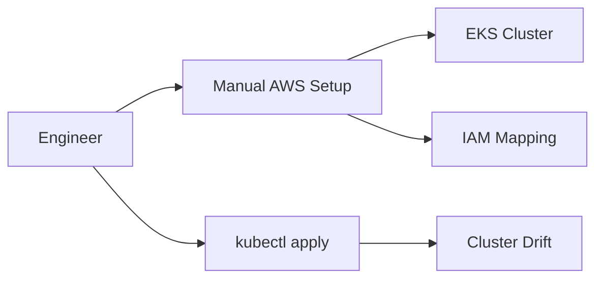
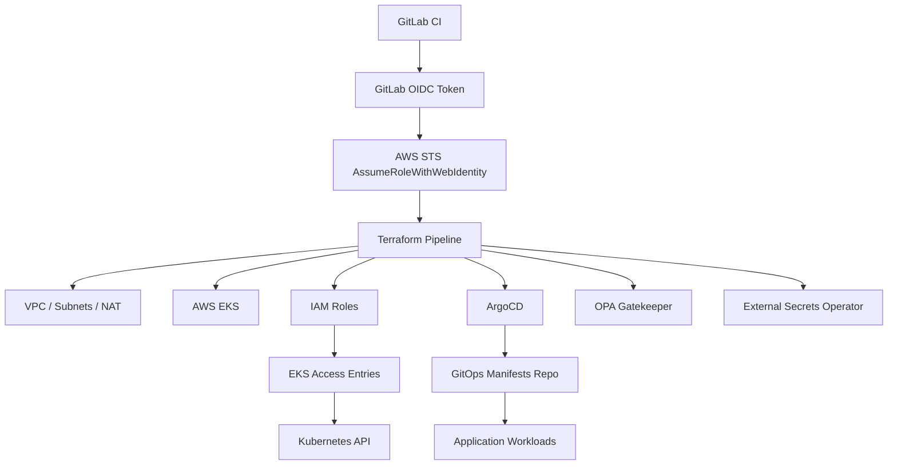
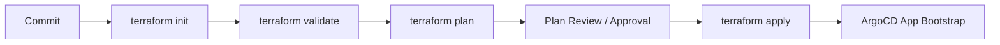
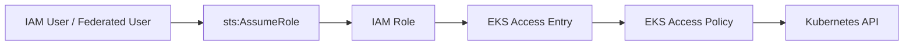
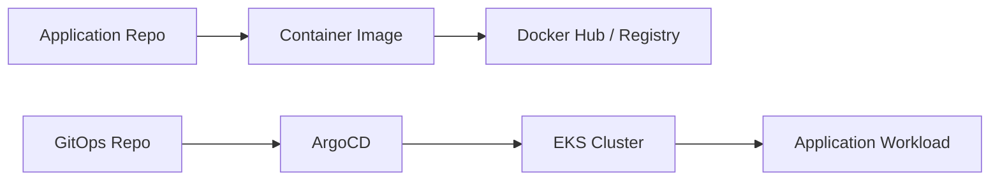

# System Design Whiteboard: Reference EKS Platform with GitOps

## Prompt

> Design an AWS EKS platform provisioned through Terraform, deployed through GitLab CI, secured with OIDC and least-privilege access, and bootstrapped for GitOps delivery through ArgoCD.

## Clarifying Questions

1. Is this a lab platform, internal developer platform, or production regulated platform?
2. How many clusters, environments, and teams are expected?
3. Should workloads be internet-facing, internal-only, or mixed?
4. What is the identity provider: IAM users, IAM Identity Center, or external IdP federation?
5. What availability target justifies single NAT vs per-AZ NAT?
6. Which policies should block immediately vs run in audit/warn mode?

## Current State Pattern

## Target Architecture

## CI/CD Flow

## Access Flow

## GitOps Flow

## Strong Whiteboard Answer

1. Start with the business goal: repeatable EKS platform provisioning with secure CI/CD and auditable app delivery.
2. Draw the CI/CD identity flow first because OIDC removes static credentials from the risk model.
3. Show Terraform provisioning order: IAM, VPC, EKS, access entries, Kubernetes/Helm add-ons.
4. Separate Terraform responsibilities from ArgoCD responsibilities.
5. Explain access entries and RBAC validation for admin/developer personas.
6. Discuss OPA Gatekeeper and External Secrets as platform guardrails.
7. Call out production hardening: per-AZ NAT, private endpoint access, SSO/Identity Center, state locking/encryption, policy rollout, observability, backup, and upgrade strategy.

## Red-Team Challenges

| Challenge | Good Answer Direction |
|-----------|------------------------|
| Why not static AWS keys in GitLab? | OIDC reduces long-lived secret risk and improves session scoping |
| Why not deploy apps with Terraform? | Terraform bootstraps platform; ArgoCD reconciles app desired state |
| Why single NAT Gateway? | Cost-friendly for reference/lab; production may need per-AZ NAT |
| How do you prove RBAC works? | Run allowed/forbidden kubectl tests for admin and developer roles |
| What if GitLab is compromised? | Scope trust policy, require approvals, use short sessions, monitor CloudTrail |
| What if ArgoCD is misconfigured? | Restrict projects/repos, use RBAC, sync windows, policy admission, and audit |

## Related Artifacts

- [Source Reference](../../knowledge/references/terraform-eks-platform-reference.md)
- [Reference Project](../../projects/platform-engineering/reference-terraform-eks-platform-gitops.md)
- [Use Case Catalog](../../projects/case-studies/terraform-eks-platform-use-case-catalog.md)

---

**Status**: Complete  
**Last Updated**: 2026-08-30
