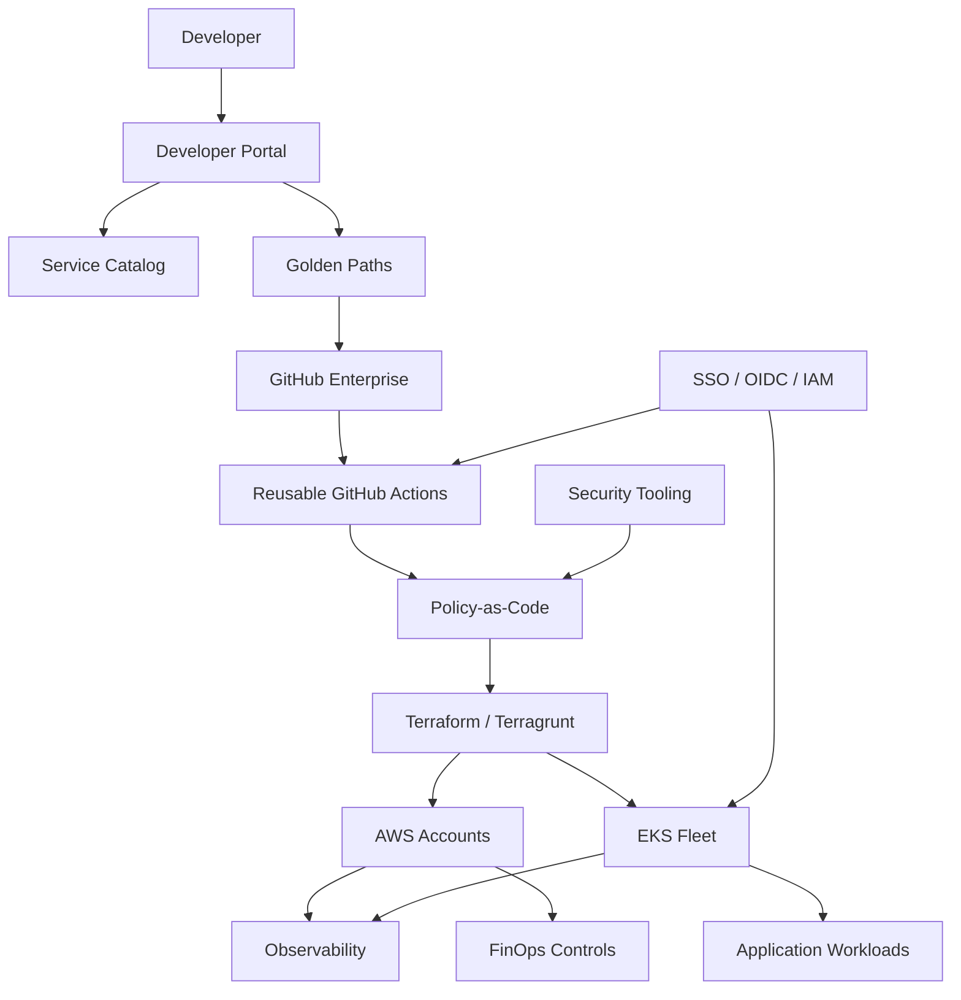

# System Design Whiteboard: Vodafone Fleet Platform

## Prompt

> Design an enterprise fleet platform for Vodafone-scale engineering teams that standardizes infrastructure, CI/CD, Kubernetes, security controls, observability, FinOps, and developer self-service.

## Clarifying Questions

1. How many engineering teams and environments must be supported?
2. Are workloads mostly Kubernetes, serverless, VM-based, or mixed?
3. Is AWS the primary cloud, or is multi-cloud required?
4. What are the highest-friction developer workflows today?
5. Which controls are mandatory: regulatory, security, cost, reliability?
6. What is the expected split between platform ownership and application-team ownership?

## Whiteboard Flow

## Strong Whiteboard Structure

1. Start with business problem: manual tickets, duplicated IaC, inconsistent security, slow onboarding.
2. Define operating model: federated platform, not fully centralized or fully decentralized.
3. Draw control plane vs workload plane.
4. Walk through developer journey and golden paths.
5. Explain Terraform/Terragrunt module/live/state strategy.
6. Explain CI/CD gates, guardrails, approvals, and rollback.
7. Explain EKS multi-tenancy and shared vs dedicated cluster criteria.
8. Explain IAM/OIDC, secrets, DevSecOps, and policy-as-code.
9. Explain observability, SLOs, reliability, and FinOps.
10. Close with migration, adoption, metrics, and failure modes.

## Red-Team Challenges

| Challenge | Response Direction |
|-----------|--------------------|
| Why not just let teams manage their own infrastructure? | Local autonomy creates drift and repeated risk; federation preserves autonomy inside guardrails |
| Why not force everything through the platform team? | Central ownership creates bottlenecks and weak product-team accountability |
| How do you prevent the portal becoming a thin UI over tickets? | Automate approved workflows end to end and measure successful provisioning without human handoff |
| What if a golden path is too restrictive? | Add exception flow, collect feedback, improve templates, keep escape hatches |
| What happens if Terraform state is corrupted? | Use isolated state, versioned backend, restore procedure, and limited blast radius |

## Related Case Study

- [Vodafone Fleet Platform Engineering](../../projects/platform-engineering/vodafone-fleet-platform-engineering.md)

---

**Status**: Complete  
**Last Updated**: 2026-08-30  
**Confidentiality Level**: INTERNAL
