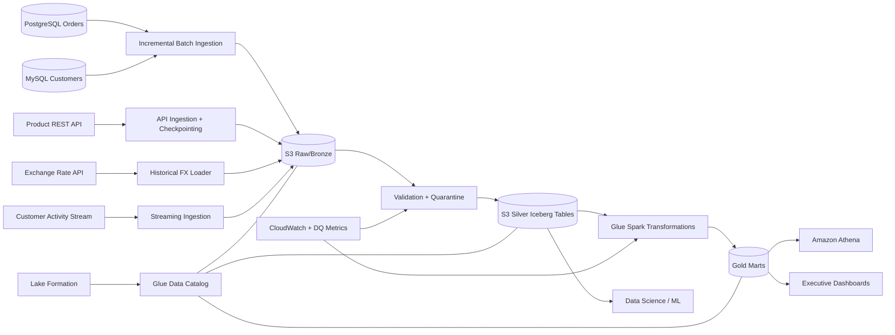
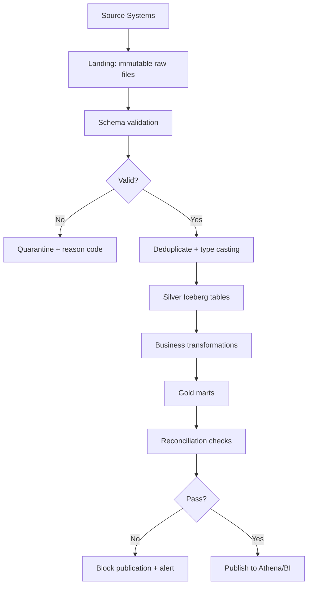

# 04 - Architecture: ShopSphere Analytics Platform

## Evidence Boundary

**Type**: Fictional interview case study. Architecture uses AWS services allowed by the prompt and general AWS service capabilities.

## High-Level Architecture

## Detailed Architecture

| Layer | Technology | Responsibility | Why |
|-------|------------|----------------|-----|
| Storage | Amazon S3 | Raw, silver, gold data lake zones | Low-cost scalable object storage for 10 TB to 100 TB |
| Table format | Apache Iceberg over Parquet | ACID MERGE, schema evolution, time travel, reproducible reporting | Needed for idempotency, corrected revenue, and reprocessing |
| Catalog | AWS Glue Data Catalog | Table metadata and schema registry-like cataloging | Integrates with Glue, Athena, Lake Formation |
| Governance | Lake Formation | Fine-grained table/column/row access and audit | PII protection and controlled analyst access |
| Batch ETL | AWS Glue Spark / PySpark | Incremental, backfill, reconciliation, Customer 360, revenue marts | Serverless Spark, pay for jobs when needed |
| Streaming | Amazon MSK/Kafka or Kinesis | Durable event ingestion with replay and lag monitoring | Use event time, watermarking, and dedupe |
| Orchestration | MWAA/Airflow | Complex dependency DAGs, backfills, retries, SLAs | Better for multi-source dependency control than ad hoc scheduling |
| Query | Athena first; Redshift optional | SQL analytics over S3; warehouse only if concurrency requires | Cost-efficient starting point |
| Security | KMS, IAM, Secrets Manager, VPC endpoints | Encryption, least privilege, secret storage, network isolation | Meets security requirements |
| Observability | CloudWatch + DQ tables | Pipeline, freshness, quality, cost, lag, anomaly alerts | Operability and interview explainability |

## Data Zones

| Zone | Contents | Access |
|------|----------|--------|
| Raw/Bronze | Immutable source-aligned data, ingestion metadata, original payloads | Restricted engineering/admin access only |
| Silver | Typed, validated, deduplicated, conformed entities | Data engineering and controlled analytical access |
| Gold | Customer 360, revenue, product conversion, executive marts | Business analysts through masked/controlled views |
| Quarantine | Invalid records with reason codes and replay status | Data engineering/steward access |
| Audit/Reconciliation | Counts, sums, watermarks, run status, exception details | Data engineering, finance, audit |

## Data Flow

## Required Deliverables Covered

This architecture pack covers high-level architecture, detailed architecture, data flow, source-to-target mapping, data model, ingestion, batch, streaming, incremental loading, CDC/change detection, data quality, governance, PII, schema evolution, error handling, retry, replay, DR, monitoring, alerting, cost, security, CI/CD, IaC, and testing.

## Related Documents

- [05 - Architecture Decisions](shopsphere-05-architecture-decisions.md)
- [06 - Data Model](shopsphere-06-data-model.md)
- [07 - Ingestion Design](shopsphere-07-ingestion-design.md)
- [17 - Interview Questions](shopsphere-17-interview-questions.md)

---

**Status**: Complete  
**Last Updated**: 2026-08-30
