# 15 - CI/CD: ShopSphere Analytics Platform

## Evidence Boundary

**Type**: Fictional interview case study.

## Git-Based Development

All infrastructure, pipeline code, SQL, PySpark transformations, data quality rules, orchestration DAGs, and documentation are version-controlled. Production deployments require approval.

## Pull Request Checks

| Check | Purpose |
|-------|---------|
| Linting | Python, SQL, Terraform, YAML formatting and style |
| Unit tests | Revenue, FX, dedupe, identity resolution, transformations |
| Data tests | Contract tests and sample data quality assertions |
| Terraform validation | `terraform fmt`, `validate`, module checks |
| Terraform plan | Review infrastructure changes before apply |
| PySpark tests | Local/unit Spark test suite with representative datasets |
| Security scanning | Secret scanning, dependency scanning, IaC scanning |
| Documentation check | Ensure ADR/runbook updates when behavior changes |

## Deployment Flow

```mermaid
flowchart LR
    PR[Pull Request] --> Lint[Lint]
    Lint --> Unit[Unit Tests]
    Unit --> DataTests[Data Tests]
    DataTests --> Sec[Security/IaC Scans]
    Sec --> TfPlan[Terraform Plan]
    TfPlan --> Review[Code Owner + Data Owner Review]
    Review --> Apply[Terraform Apply]
    Apply --> Deploy[Deploy Glue/Airflow/SQL]
    Deploy --> Smoke[Smoke + Freshness Checks]
    Smoke --> Release[Production Publication]
```

## Environment Strategy

| Environment | Purpose |
|-------------|---------|
| Dev | Developer iteration, sample data, fast tests |
| Test | Integration tests, contract tests, replay tests |
| Stage | Production-like validation with masked data |
| Prod | Approved production processing and publication |

## Infrastructure-as-Code Strategy

Terraform manages:

- S3 buckets, KMS keys, lifecycle policies.
- Glue databases/jobs/crawlers/catalog resources where appropriate.
- Lake Formation permissions/tags where feasible.
- IAM roles and policies.
- CloudWatch dashboards/alarms.
- Secrets Manager references, not plaintext secrets.
- MWAA/Airflow environment if selected.

## Release Controls

- Production `apply` requires approval.
- Data contract breaking changes require data owner approval.
- Critical quality rule changes require finance/data governance approval.
- Rollback path must be documented for pipeline code, infrastructure, and published tables.

## Related Documents

- [14 - Testing](shopsphere-14-testing.md)
- [16 - Runbook](shopsphere-16-runbook.md)

---

**Status**: Complete  
**Last Updated**: 2026-08-30
