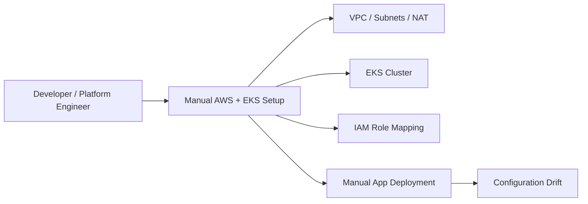
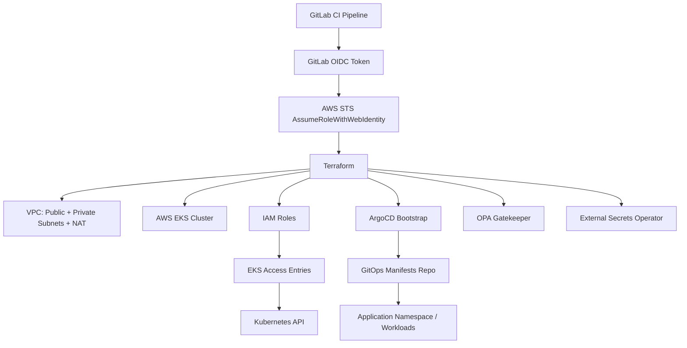
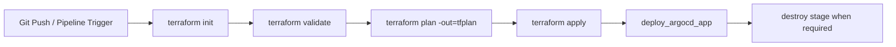
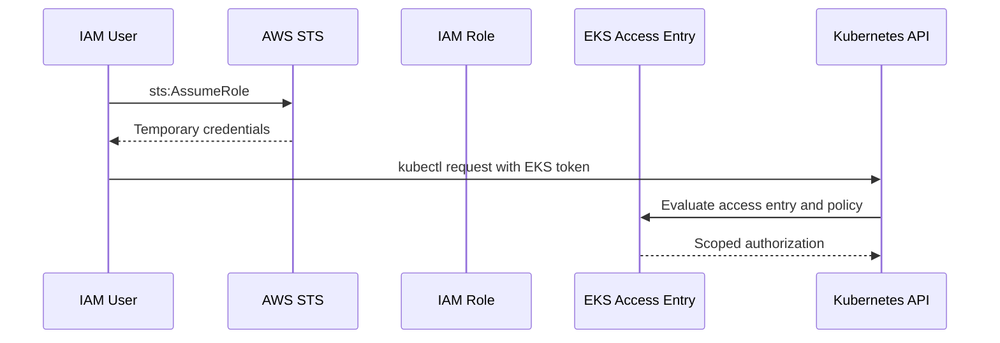

# Reference EKS Platform with GitOps, OIDC, Policy-as-Code, and Secrets Management

## 1. Metadata & Confidentiality

| Field | Value |
|-------|-------|
| Case Study Title | Reference EKS Platform with GitOps, OIDC, Policy-as-Code, and Secrets Management |
| Source Repository | `ranjitha-su/terraform-eks-platform` |
| Source URL | https://github.com/ranjitha-su/terraform-eks-platform |
| Classification | Reference Implementation / Lab Project |
| Client / Organisation | Public GitHub reference repository |
| Industry | Platform Engineering / Cloud Infrastructure |
| My Role | Platform Engineering learner / architectural analyst unless direct contribution is confirmed |

**Confidentiality Level**: PUBLIC  
**Client Anonymised**: N/A  
**Sensitive Details Removed**: Yes  
**Safe to Share**: Yes

## Evidence Classification

**Current status**: Public reference implementation analysis.  
**Measured outcomes**: None supplied.  
**Personal contribution**: Do not claim implementation ownership unless separately confirmed.  
**Primary source**: [terraform-eks-platform reference note](../../knowledge/references/terraform-eks-platform-reference.md).

## 2. Executive Summary

This reference project demonstrates how a Terraform-based AWS EKS platform can be provisioned and bootstrapped through CI/CD while applying DevSecOps principles. The platform provisions AWS network foundations, an EKS cluster, managed node groups, IAM roles, EKS Access Entries, a Kubernetes namespace, and GitOps tooling via ArgoCD. The CI/CD pipeline uses GitLab OIDC federation to assume an AWS role without storing static cloud credentials. The architecture is interview-relevant because it connects core Platform Engineering capabilities: infrastructure as code, secure CI/CD, Kubernetes access governance, GitOps delivery, policy-as-code with OPA Gatekeeper, and runtime secrets management through External Secrets Operator. This artifact converts the public repository into an evidence-safe interview case study and use-case library.

## 3. Business Problem

Engineering teams need a repeatable way to create secure Kubernetes platforms without manually assembling VPCs, EKS clusters, IAM roles, access controls, GitOps controllers, and policy/secrets tooling. Manual cluster setup creates drift, inconsistent access, unclear deployment ownership, and weak auditability.

### Impact Areas

- **Operational impact**: Manual setup increases toil and configuration drift.
- **Security impact**: Static CI/CD credentials and broad cluster permissions increase breach impact.
- **Delivery impact**: Teams cannot consistently bootstrap a cluster and deployment path.
- **Governance impact**: Kubernetes access and policy enforcement are hard to standardize after clusters are already in use.
- **Developer productivity impact**: Application teams depend on platform engineers for foundational setup and access troubleshooting.

## 4. Existing State / Before Pattern

## 5. Goals

| ID | Goal | Success Criteria |
|----|------|------------------|
| G-01 | Automate EKS platform provisioning | Terraform creates network, EKS, IAM access, and Kubernetes namespace resources |
| G-02 | Avoid static CI/CD cloud credentials | GitLab CI uses OIDC and `sts:AssumeRoleWithWebIdentity` |
| G-03 | Standardize Kubernetes API access | EKS Access Entries map IAM roles to scoped Kubernetes access |
| G-04 | Bootstrap GitOps delivery | ArgoCD is installed into the cluster and can manage application manifests |
| G-05 | Introduce platform guardrails | OPA Gatekeeper and External Secrets patterns provide policy/secrets foundations |

## 6. Non-Goals

- Prove production business outcomes.
- Claim personal delivery or ownership.
- Replace a full enterprise landing zone.
- Design every production requirement such as multi-region DR, private-only cluster access, or full observability.
- Treat a lab/reference implementation as complete enterprise production proof.

## 7. Functional Requirements

| ID | Requirement |
|----|-------------|
| FR-01 | Provision AWS VPC, subnets, NAT, EKS, managed node groups, IAM roles, and Kubernetes namespace via Terraform |
| FR-02 | Use GitLab CI stages for `init`, `validate`, `plan`, `apply`, `deploy_argocd_app`, and `destroy` |
| FR-03 | Authenticate CI/CD to AWS using OIDC rather than static credentials |
| FR-04 | Register IAM roles as EKS Access Entry principals |
| FR-05 | Scope developer Kubernetes API access to the `online-boutique` namespace |
| FR-06 | Bootstrap ArgoCD for GitOps delivery |
| FR-07 | Include policy enforcement and secrets-management platform components |

## 8. Non-Functional Requirements

| ID | Requirement |
|----|-------------|
| NFR-01 | CI/CD authentication must use short-lived credentials |
| NFR-02 | Terraform state must use a remote backend with versioning |
| NFR-03 | Kubernetes access must be least-privilege and testable |
| NFR-04 | Pipeline stages must separate validation, planning, approval/application, and teardown |
| NFR-05 | Platform design must be reproducible and explainable in interviews |

## 9. Target Architecture

## 10. Control Plane vs Workload Plane

### Platform Control Plane

- Terraform modules and root composition.
- GitLab CI pipeline and OIDC role assumption.
- AWS VPC/EKS/IAM foundation.
- EKS Access Entries and Kubernetes access policies.
- ArgoCD installation and platform add-ons.
- OPA Gatekeeper and External Secrets Operator.

### Workload Plane

- Application manifests managed through GitOps repositories.
- Namespaced workloads such as `online-boutique`.
- Application-specific service configuration, image tags, and runtime settings.

## 11. Terraform Architecture

### Observed Root Composition

- `modules/iam`: creates IAM roles such as `external-aws-k8s-admin` and `external-aws-k8s-developer`.
- `modules/eks`: provisions the EKS cluster and access entries.
- `modules/argocd`: bootstraps ArgoCD.
- `modules/istio`: bootstraps Istio platform capability.

### Provider Model

- AWS provider for cloud infrastructure.
- Kubernetes provider authenticated through `aws eks get-token`.
- Helm provider authenticated against the EKS cluster.

### State Governance

The README states the S3 backend bucket must be created before the pipeline runs and versioning should be enabled to preserve state history.

## 12. GitLab CI/CD Architecture

### Security Design

GitLab CI obtains a `GITLAB_OIDC_TOKEN`, exchanges it with AWS STS using `assume-role-with-web-identity`, and receives short-lived AWS credentials for the pipeline run. This avoids storing static AWS access keys in CI/CD.

## 13. EKS Access Model

| Role | Policy | Scope |
|------|--------|-------|
| `external-aws-k8s-admin` | `AmazonEKSViewPolicy` | Cluster-wide view |
| `external-aws-k8s-developer` | `AmazonEKSViewPolicy` | Namespace-scoped view for `online-boutique` |

## 14. GitOps and Application Delivery

The repository is part of a three-repo flow:

1. Application source repo builds and publishes application artifacts.
2. GitOps repo stores Kubernetes manifests/Kustomize overlays.
3. Platform repo provisions EKS and bootstraps ArgoCD to reconcile workloads.

This separation makes ownership clearer: app teams own app code and manifests, while platform teams own cluster/platform bootstrap.

## 15. Policy and Secrets

### OPA Gatekeeper

OPA Gatekeeper provides Kubernetes admission policy enforcement. Interview examples include required labels, restricted privileged pods, approved image registries, and namespace ownership controls.

### External Secrets Operator

External Secrets Operator allows Kubernetes workloads to consume secrets from an external secrets store without storing raw secret values in Git manifests.

## 16. Testing Strategy

The README documents access validation tests:

### Admin Role

- `kubectl get pods -A` should pass.
- `kubectl delete pod <pod-name> -n <namespace>` should be forbidden.
- `kubectl create namespace test-ns` should be forbidden.

### Developer Role

- `kubectl get pods -n online-boutique` should pass.
- `kubectl get pods -A` should be forbidden.
- `kubectl get pods -n kube-system` should be forbidden.
- `kubectl get nodes` should be forbidden.

## 17. Security Review

| Area | Strong Pattern | Gap / Production Consideration |
|------|----------------|---------------------------------|
| CI/CD credentials | GitLab OIDC avoids static AWS keys | Trust policy should scope repo/project/ref/environment tightly |
| Kubernetes access | EKS Access Entries and view-only policies | Production should integrate IAM Identity Center / SSO rather than manually-created IAM users |
| Terraform state | S3 backend with versioning | Add state locking/encryption policy verification and least-privilege backend access |
| Secrets | External Secrets pattern | Define rotation, audit, and secret-store access boundaries |
| Policy | OPA Gatekeeper pattern | Define warn vs block rollout strategy and exception handling |

## 18. Architecture Decisions

- [ADR-01: GitLab OIDC vs Static AWS Credentials](../../architecture/architecture-decisions/adr-reference-eks-gitlab-oidc-vs-static-credentials.md)
- [ADR-02: EKS Access Entries vs aws-auth ConfigMap](../../architecture/architecture-decisions/adr-reference-eks-access-entries-vs-aws-auth-configmap.md)
- [ADR-03: ArgoCD Bootstrap vs Manual Deployment](../../architecture/architecture-decisions/adr-reference-eks-argocd-bootstrap-vs-manual-deploy.md)
- [ADR-04: OPA Gatekeeper Policy Enforcement](../../architecture/architecture-decisions/adr-reference-eks-opa-gatekeeper-policy.md)
- [ADR-05: External Secrets Operator](../../architecture/architecture-decisions/adr-reference-eks-external-secrets.md)
- [ADR-06: Single NAT Gateway vs HA NAT](../../architecture/architecture-decisions/adr-reference-eks-single-nat-vs-ha-nat.md)

## 19. Interview Story

### 2-Minute Version

I analyzed a public Terraform-based EKS platform reference implementation and decomposed it into interview-ready Platform Engineering patterns. The repo provisions an AWS EKS platform using Terraform, with GitLab CI executing init/validate/plan/apply stages through OIDC-based AWS role assumption, avoiding static credentials. It uses IAM roles and EKS Access Entries to provide cluster-wide read access for an admin role and namespace-scoped read access for a developer role. It also demonstrates a GitOps bootstrap path with ArgoCD and includes policy/secrets platform components through OPA Gatekeeper and External Secrets Operator. The interview value is that it connects infrastructure provisioning, secure CI/CD, Kubernetes RBAC, GitOps, and DevSecOps controls into one coherent platform story.

### 5-Minute Version

Expand on the CI/CD trust model, Terraform module composition, S3 remote state requirements, Kubernetes provider/Helm provider authentication through EKS token generation, EKS access-entry tests, and the three-repo delivery separation between app, GitOps manifests, and platform infrastructure.

### 15-Minute Deep Dive

Walk through the business problem, target architecture, Terraform modules, GitLab OIDC flow, EKS access entries, admin/developer test matrix, ArgoCD bootstrap, OPA Gatekeeper policy examples, External Secrets model, single NAT trade-off, production hardening gaps, and migration from a manually-created EKS cluster to the Terraform/GitOps model.

## 20. Interview Questions

- [GitLab OIDC for Terraform](../../interview/questions/devsecops/reference-eks-gitlab-oidc-terraform.md)
- [EKS Access Entries and RBAC](../../interview/questions/architecture/reference-eks-access-entries-rbac.md)
- [EKS Platform Bootstrap](../../interview/questions/platform-engineering/reference-eks-platform-bootstrap.md)
- [GitLab CI Terraform Pipeline](../../interview/questions/devops/reference-eks-gitlab-ci-terraform-pipeline.md)
- [ArgoCD GitOps Bootstrap](../../interview/questions/kubernetes/reference-eks-argocd-gitops-bootstrap.md)
- [OPA Gatekeeper and External Secrets](../../interview/questions/devsecops/reference-eks-opa-external-secrets.md)

## 21. Related Artifacts

- [Source Reference](../../knowledge/references/terraform-eks-platform-reference.md)
- [Use Case Catalog](../case-studies/terraform-eks-platform-use-case-catalog.md)
- [Whiteboard Scenario](../../interview/system-design/reference-eks-platform-gitops-whiteboard.md)
- [Secure CI/CD STAR Story](../../interview/star-stories/reference-eks-secure-ci-oidc.md)
- [RBAC Access Model STAR Story](../../interview/star-stories/reference-eks-rbac-access-model.md)
- [GitOps Platform Bootstrap STAR Story](../../interview/star-stories/reference-eks-gitops-platform-bootstrap.md)

## CV-Safe Wording

> Analyzed and documented a Terraform-based EKS platform reference implementation covering GitLab OIDC, EKS access entries, ArgoCD bootstrap, OPA Gatekeeper, and External Secrets; produced ADRs, interview questions, and reusable Platform Engineering design patterns for interview preparation.

---

**Status**: Complete  
**Last Updated**: 2026-08-30  
**Review Date**: TBD
