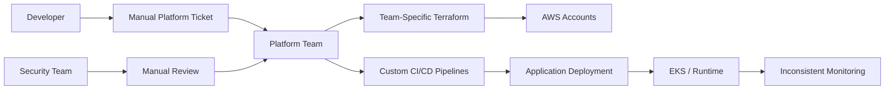
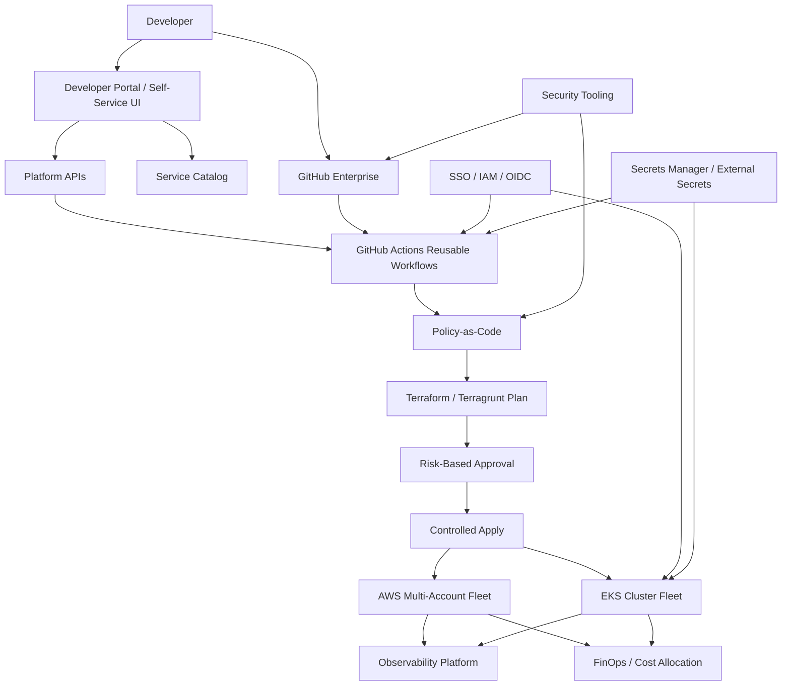
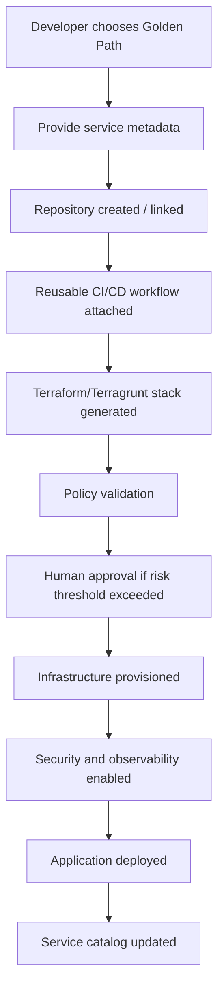
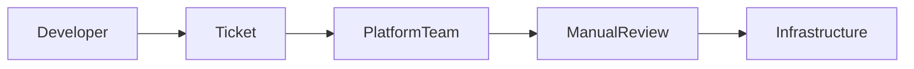
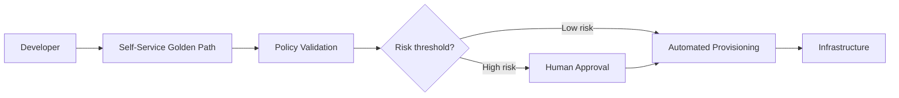
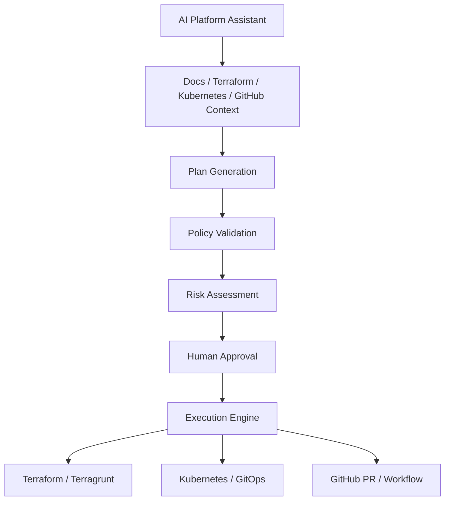

# Vodafone Fleet Platform Engineering & Developer Self-Service

## 1. Metadata & Confidentiality

| Field | Value |
|-------|-------|
| Case Study Title | Vodafone Fleet Platform Engineering & Developer Self-Service |
| Client / Organisation | Vodafone |
| Anonymised Name (if required) | N/A |
| Industry | Telecommunications / Digital Services |
| Business Unit | Platform Engineering / Cloud Engineering / Developer Experience (hypothetical framing) |
| Engagement Period | TBD |
| My Role | Platform Engineering Architect / Principal Platform Engineer (hypothetical interview framing) |
| Key Stakeholders | Engineering Leadership, Application Teams, Security, Cloud Platform, SRE, FinOps, Operations, Product Owners |

**Confidentiality Level**: INTERNAL  
**Client Anonymised**: No  
**Sensitive Details Removed**: Yes  
**Safe to Share**: Internal interview preparation only

## Evidence Classification

**Current status**: Hypothetical/reference architecture.  
**Measured outcomes**: None supplied. All numeric goals below are labeled as `Illustrative target`.  
**Personal contribution**: Treat as interview framing only until real Vodafone engagement evidence is added.  
**Source of truth**: User-provided master prompt and repository Platform Engineering knowledge structure.

## 2. Executive Summary

Vodafone-scale engineering requires a platform model that can manage a fleet of cloud accounts, Kubernetes clusters, infrastructure modules, CI/CD workflows, security controls, and observability standards without forcing every team through manual platform tickets. This reference architecture proposes an enterprise Fleet Platform that gives application teams self-service golden paths while the platform team owns reusable infrastructure modules, policy-as-code guardrails, identity integration, standardized pipelines, and fleet-level reliability/cost governance. The design uses GitHub Enterprise, GitHub Actions, Terraform/Terragrunt, AWS multi-account architecture, Amazon EKS, OIDC federation, Kubernetes RBAC, secrets management, observability standards, and FinOps controls. The core principle is federated ownership: the platform provides paved roads and safe APIs; application teams own service code, service-level configuration, and operational readiness. The outcome is an interview-ready architecture that demonstrates business alignment, technical depth, governance, developer experience, migration strategy, failure handling, and principal-level trade-off reasoning.

## 3. Business Problem

Large enterprise engineering organizations often reach a point where cloud growth outpaces operating model maturity. Application teams need new AWS accounts, EKS namespaces, CI/CD pipelines, DNS records, IAM roles, secrets access, monitoring dashboards, and production controls. When every request becomes a ticket to the platform team, the platform becomes a bottleneck instead of an accelerator.

### What Was Wrong

- Infrastructure provisioning depended on manual platform tickets.
- Terraform modules were duplicated across teams and environments.
- Kubernetes clusters had inconsistent RBAC, namespace standards, resource quotas, and deployment models.
- CI/CD pipelines used inconsistent scanning, approval, and rollback patterns.
- IAM roles were overly permissive or manually managed.
- Secrets handling varied by team.
- Observability and SLO definitions were inconsistent.
- Cloud cost allocation was incomplete due to inconsistent tagging and ownership metadata.

### Why It Mattered

- **Operational impact**: Platform teams became overloaded by repetitive provisioning and support work.
- **Financial impact**: Cloud waste became harder to identify without consistent tags, budgets, and ownership.
- **Security impact**: Inconsistent IAM, scanning, and secrets controls increased governance risk.
- **Developer productivity impact**: Teams waited days for standard infrastructure and pipeline changes.
- **Delivery impact**: Slow onboarding delayed product releases.
- **Reliability impact**: Services lacked consistent SLOs, dashboards, alerts, runbooks, and rollback paths.

## 4. Existing State



### Existing State Summary

| Area | Existing State |
|------|----------------|
| Infrastructure | Multi-account AWS footprint with duplicated Terraform and inconsistent state boundaries |
| Teams | Central platform team manually servicing many application teams |
| Processes | Ticket-driven provisioning and manual approvals |
| CI/CD | Mixed pipeline patterns, inconsistent reusable workflows, incomplete security stages |
| IAM | Manual role creation, broad permissions, inconsistent workload identity |
| Kubernetes | EKS clusters with inconsistent namespace/RBAC/resource policies |
| Monitoring | Team-specific dashboards and alerts; inconsistent SLO ownership |
| Security | Security gates applied differently by repo/team |
| Support model | Platform team as request queue and escalation owner for repetitive tasks |

## 5. Root Cause Analysis

### 5 Whys

1. **Why is provisioning slow?** Because developers raise tickets and wait for platform engineers.
2. **Why are tickets required?** Because infrastructure workflows are not exposed through approved self-service APIs/golden paths.
3. **Why are workflows not self-service?** Because Terraform modules, CI/CD standards, IAM patterns, and governance controls are inconsistent.
4. **Why are standards inconsistent?** Because each team optimized locally without a platform product model or shared lifecycle strategy.
5. **Why did the model not scale?** Because the organization treated infrastructure as bespoke project work rather than reusable product capabilities with adoption, documentation, ownership, and metrics.

### Root Causes

- Missing platform product ownership and roadmap.
- Lack of standardized golden paths.
- Weak separation between platform control plane and workload ownership.
- Inconsistent IaC module/version strategy.
- Governance relied on manual review rather than automated guardrails.
- Limited developer feedback loop and adoption strategy.

## 6. Goals

| ID | Goal | Success Criteria |
|----|------|------------------|
| G-01 | Reduce provisioning lead time | Illustrative target: standard infrastructure available in < 30 minutes instead of multi-day ticket flow |
| G-02 | Reduce platform ticket load | Illustrative target: 50-70% fewer repetitive provisioning tickets through golden paths |
| G-03 | Standardize security controls | All golden paths include IAM, secrets, scanning, policy-as-code, and audit logging by default |
| G-04 | Improve developer experience | Developers can create services, environments, and standard infrastructure through self-service workflows |
| G-05 | Improve fleet governance | Fleet-level visibility for accounts, clusters, modules, pipelines, vulnerabilities, tags, and cost ownership |
| G-06 | Enable safer autonomy | Teams can move quickly within guardrails; risky changes require approval or escalation |

## 7. Non-Goals

- Replace all bespoke infrastructure with a single abstraction.
- Eliminate platform engineering support entirely.
- Force every workload into Kubernetes.
- Build a custom developer portal if a mature product meets requirements.
- Allow developers unrestricted cloud write access.
- Hide all cloud complexity from senior engineers; the platform should simplify routine work while preserving escape hatches.
- Claim measured Vodafone business outcomes without supplied evidence.

## 8. Functional Requirements

| ID | Requirement |
|----|-------------|
| FR-01 | Developers can request approved golden paths without manual platform tickets |
| FR-02 | Platform can create repositories, CI/CD workflows, Terraform/Terragrunt stack definitions, and baseline observability |
| FR-03 | Infrastructure changes run through PR validation, policy checks, Terraform plan, approval, and controlled apply |
| FR-04 | EKS workloads use namespace standards, RBAC, resource quotas, network policies, and workload identity |
| FR-05 | Secrets are stored outside Git and injected through approved runtime/CI mechanisms |
| FR-06 | Policies enforce mandatory tags, encryption, approved regions, public exposure controls, and Kubernetes pod security |
| FR-07 | Every provisioned service has ownership metadata, cost tags, dashboards, alerts, and runbook links |
| FR-08 | Platform exposes audit trails for approvals, deployments, access changes, and policy violations |

## 9. Non-Functional Requirements

| ID | Requirement |
|----|-------------|
| NFR-01 | Platform control plane availability target: Illustrative target 99.9% for self-service workflows |
| NFR-02 | Infrastructure apply operations must be idempotent and recoverable from failed runs |
| NFR-03 | No long-lived AWS credentials in GitHub or developer machines for automated provisioning |
| NFR-04 | Platform APIs and workflows must enforce least privilege and blast-radius boundaries |
| NFR-05 | Terraform state must be isolated by account/environment/capability to avoid global locks and wide blast radius |
| NFR-06 | Audit logs must identify requester, approver, workflow, policy decision, and infrastructure change |
| NFR-07 | Golden paths must support versioning and migration from older templates/modules |
| NFR-08 | Critical platform components must have documented RTO/RPO and recovery procedures |

## 10. Target Architecture



### Major Components

| Component | Responsibility |
|-----------|----------------|
| Developer Portal | Front door for golden paths, service catalog, ownership metadata, and documentation |
| Platform APIs | Controlled orchestration layer for provisioning requests and workflow triggers |
| GitHub Enterprise | Source control, pull requests, CODEOWNERS, reusable workflows, and audit trail |
| GitHub Actions | Standard CI/CD execution and Terraform/Terragrunt plan/apply orchestration |
| Terraform/Terragrunt | Declarative infrastructure modules and environment composition |
| AWS Multi-Account Fleet | Account segmentation for workload isolation, environment separation, and security boundaries |
| EKS Fleet | Standard Kubernetes runtime for containerized workloads where Kubernetes is appropriate |
| OIDC / IAM | Short-lived credential federation and least-privilege permissions |
| Policy-as-Code | Automated guardrails for security, compliance, reliability, and cost standards |
| Observability | Logs, metrics, traces, dashboards, alerts, SLOs, and operational readiness evidence |
| FinOps | Tags, budgets, cost allocation, idle resource detection, and showback/chargeback |

## 11. Platform Architecture

### Control Plane

Owned by the platform team:

- Developer portal / service catalog.
- Platform APIs and orchestration workflows.
- Terraform module registry and Terragrunt live structure standards.
- GitHub reusable workflows and pipeline templates.
- EKS baseline cluster add-ons and policy sets.
- IAM/OIDC trust models and permission boundaries.
- Policy-as-code and security guardrails.
- Observability, FinOps, and governance standards.

### Workload / Data Plane

Owned by application teams within platform guardrails:

- Application source code.
- Service-level configuration.
- Workload manifests / Helm chart values.
- Environment-specific sizing.
- Service runbooks and SLO ownership.
- Deployment timing and release decisions.

### Outside the Platform

- Product roadmap decisions.
- Business-specific application logic.
- Manual emergency break-glass approvals.
- Security exceptions requiring risk acceptance.

## 12. Developer Experience



### Developer Provides

- Service name, owner, product area, cost center, data classification.
- Runtime choice (EKS service, serverless service, managed database, static service).
- Environment targets (dev/test/stage/prod).
- Expected availability tier and support model.
- Network exposure (internal, partner, internet-facing).
- Dependencies and integration points.

### Platform Handles Automatically

- Repository scaffolding and branch protection.
- Reusable CI/CD workflow configuration.
- Terraform/Terragrunt stack generation.
- IAM roles, workload identity, and least-privilege permission templates.
- Policy checks and security scanning.
- Standard dashboards, alerts, runbook template, and service catalog entry.
- Tags, budgets, and cost allocation metadata.

## 13. Golden Paths

### Golden Path 1: New Kubernetes Application

| Area | Design |
|------|--------|
| Inputs | Service metadata, runtime tier, environment, namespace, resource profile, exposure type |
| Automation | Repo scaffold, Helm chart, GitHub Actions workflow, namespace, RBAC, service account, baseline dashboard |
| Infrastructure | EKS namespace, IRSA/workload identity, ingress route, network policy, resource quotas |
| Security | SAST/SCA/container scan, signed images, approved registry, policy-as-code checks |
| Outputs | Running service, deployment workflow, dashboard, alerts, runbook placeholder, catalog entry |

### Golden Path 2: Managed Database

| Area | Design |
|------|--------|
| Inputs | Engine, size tier, backup policy, data classification, network access, owner |
| Automation | Terraform module, encryption, backup, monitoring, access role, secret reference |
| Infrastructure | RDS/Aurora or approved managed database pattern |
| Security | KMS encryption, private networking, least-privilege access, rotation path |
| Outputs | Database endpoint reference, secret reference, backup policy, dashboard, cost tags |

### Golden Path 3: Production-Ready AWS Service

| Area | Design |
|------|--------|
| Inputs | Service type, availability tier, account/environment, network exposure, ownership |
| Automation | Account/environment placement, IAM roles, logging, monitoring, budget, deployment pipeline |
| Infrastructure | Lambda/ECS/EKS pattern depending on workload needs |
| Security | OIDC, IAM boundaries, scanning, audit logging, public exposure policy |
| Outputs | Infrastructure PR, plan result, approved deployment, service catalog metadata |

## 14. Self-Service Architecture

### Before



### After



### Controls Preventing Unsafe Changes

- Restricted golden-path inputs and schema validation.
- Pull requests with CODEOWNERS and branch protection.
- Policy-as-code checks for security and cost controls.
- Environment-specific approval gates.
- OIDC-scoped permissions per account/environment.
- Drift detection and change audit logs.

## 15. Terraform / Terragrunt Architecture

```text
platform-iac/
├── modules/
│   ├── aws-account-baseline/
│   ├── eks-cluster/
│   ├── eks-namespace/
│   ├── iam-workload-role/
│   ├── rds-standard/
│   ├── observability-baseline/
│   └── cost-guardrails/
├── live/
│   ├── prod/
│   │   ├── network/
│   │   ├── shared-services/
│   │   └── teams/
│   ├── nonprod/
│   └── sandbox/
├── policies/
│   ├── terraform/
│   ├── kubernetes/
│   └── github-actions/
└── workflows/
    ├── terraform-plan.yml
    ├── terraform-apply.yml
    └── drift-detection.yml
```

### Design Choices

- **Modules** provide reusable, tested infrastructure building blocks.
- **Terragrunt live directories** compose modules per account/environment/team.
- **Remote state** is stored in encrypted S3 with DynamoDB locking or approved backend equivalent.
- **State isolation** by account/environment/capability reduces lock contention and blast radius.
- **Module versioning** uses semantic versions and release notes.
- **Provider versioning** is pinned and upgraded through controlled waves.
- **Drift detection** runs scheduled `plan` workflows and raises issues/alerts for unmanaged changes.
- **Import strategy** uses import-and-reconcile for existing resources, with zero-diff validation before cutover.

## 16. CI/CD Architecture

```mermaid
flowchart LR
    PR[Pull Request] --> Lint[Lint / Format]
    Lint --> Unit[Unit Tests]
    Unit --> SAST[SAST / SCA]
    SAST --> IaC[IaC Scan]
    IaC --> Container[Container Scan]
    Container --> Plan[Terraform Plan]
    Plan --> Comment[Plan Comment / Evidence]
    Comment --> Approval[CODEOWNERS / Env Approval]
    Approval --> Apply[Deploy / Apply]
    Apply --> Verify[Smoke / Health Verification]
    Verify --> Rollback[Rollback Path Documented]
```



### Pipeline Controls

- Reusable GitHub Actions workflows enforce consistent validation.
- Low-risk changes can auto-apply after policy pass and required reviews.
- High-risk changes require security/platform approval.
- Rollback uses application deployment rollback plus Terraform module version rollback where safe.
- Pipeline evidence is retained in GitHub checks and audit logs.

## 17. Kubernetes / EKS Architecture

### Cluster Fleet Model

- Shared platform-managed EKS clusters for standardized workloads where multi-tenancy risk is acceptable.
- Dedicated clusters for regulated, high-risk, or noisy-neighbor workloads.
- Cluster add-ons managed by the platform team: ingress, external-dns, cert-manager, policy controller, metrics/logging agents, workload identity, and GitOps controller where applicable.

### Multi-Tenancy Controls

- Namespace per service/team/environment.
- Kubernetes RBAC bound to enterprise identity groups.
- Network policies for east-west traffic isolation.
- Resource quotas and limit ranges.
- Pod security standards / admission policy.
- IRSA or equivalent workload identity for AWS access.
- Horizontal Pod Autoscaler and Cluster Autoscaler/Karpenter where appropriate.
- Helm chart standardization and GitOps deployment flow.

## 18. IAM and Security

### Human Identity

- Enterprise SSO with MFA.
- Role-based access via identity groups.
- Privileged roles require approval and time-bound elevation.
- Break-glass access is logged, monitored, and reviewed.

### Machine Identity

- GitHub Actions uses OIDC to assume short-lived AWS roles.
- Workloads use Kubernetes service accounts mapped to scoped IAM roles.
- Permission boundaries prevent privilege escalation.
- IAM policies are generated from approved module templates and reviewed by policy-as-code.

### Avoiding Long-Lived Credentials

- No static AWS keys in GitHub, local config, or CI/CD variables.
- Secrets live in approved stores and are accessed through short-lived identities.
- Secret scanning blocks committed credentials.

## 19. Secrets Management

| Concern | Design |
|---------|--------|
| Where secrets live | AWS Secrets Manager / approved enterprise vault |
| Application access | External Secrets Operator or runtime retrieval via workload identity |
| CI/CD access | OIDC-scoped roles retrieve only required deployment secrets |
| Rotation | Rotation policy per secret class; automated where provider supports it |
| Audit | Access logs routed to SIEM/Splunk/CloudWatch and reviewed for anomalies |
| Preventing Git leaks | Secret scanning, push protection, developer education |
| Preventing Terraform state leaks | Avoid storing sensitive values in state; use references/ARNs where possible |
| Preventing log leaks | Masking, structured logging controls, policy checks for known sensitive fields |

## 20. DevSecOps

### Security Controls

| Control | Action |
|---------|--------|
| Secrets scanning | Block committed secrets |
| SAST | Warn or block by severity and branch/environment |
| SCA/dependency scanning | Block critical exploitable vulnerabilities in production paths |
| Container scanning | Block critical image vulnerabilities unless exception approved |
| IaC scanning | Block public storage, unencrypted data stores, unrestricted ingress |
| Policy-as-code | Enforce tags, regions, encryption, IAM boundaries, Kubernetes pod standards |
| Vulnerability management | Route findings to owners with SLA by severity |

### Guardrails vs Gates

- **Guardrails** guide teams toward safe defaults without stopping every change.
- **Gates** block changes that exceed risk thresholds, violate policy, or require explicit risk acceptance.

## 21. Policy as Code

Recommended tools include OPA/Conftest for general policies, Checkov for IaC scanning, Kyverno for Kubernetes admission control, and Terraform policy tooling where enterprise standards require it.

### Example Policies

- Mandatory tags: `owner`, `cost_center`, `environment`, `data_classification`.
- Encryption required for storage, database, queues, and state backends.
- Restricted regions based on legal/compliance constraints.
- Public S3 buckets prohibited unless exception approved.
- Privileged Kubernetes pods prohibited.
- Approved container registries only.
- Mandatory logging for internet-facing services.

## 22. Observability

### Design

- **Metrics**: Prometheus/Grafana for Kubernetes workloads; CloudWatch for AWS service metrics.
- **Logs**: Centralized logging through Splunk or Elastic depending on enterprise standard.
- **Traces**: OpenTelemetry where distributed tracing is required.
- **Dashboards**: Golden path creates service dashboard by default.
- **Alerts**: Alerts must map to SLOs/runbooks, not raw noise.
- **SLOs/SLIs**: Availability, latency, error rate, saturation, deployment health.

## 23. Reliability / SRE

| Reliability Area | Design |
|------------------|--------|
| Failure domains | Multi-AZ by default for production workloads |
| SLOs | Service-specific SLOs generated through golden-path templates |
| Error budgets | Used to balance feature delivery vs reliability investment |
| RTO/RPO | Defined by service tier; illustrative examples only until real requirements are supplied |
| Backup | Managed service backups enabled by default for stateful components |
| Rollback | Application rollback via deployment tooling; infra rollback through module version control when safe |
| Chaos testing | Optional for high-criticality services after baseline maturity |

## 24. FinOps

### Cost Governance

- Mandatory tags for owner, product, cost center, environment, and data classification.
- Budgets and alerts per account/team/service.
- Idle resource detection for unused load balancers, volumes, snapshots, IPs, and oversized clusters.
- Autoscaling for EKS workloads and node groups.
- Non-production shutdown schedules where appropriate.
- Showback dashboards for engineering teams; chargeback if organizational policy requires it.

## 25. Governance

### Automated Standards

- Repository standards through templates and branch protections.
- Pipeline standards through reusable workflows.
- Infrastructure standards through modules and policy checks.
- Naming/tagging conventions enforced at plan/admission time.
- Lifecycle management through module versioning and deprecation policy.
- Exceptions captured with owner, expiry, and risk acceptance.

## 26. Architecture Decision Records

Detailed ADRs are extracted into separate files:

| ADR | Decision | Link |
|-----|----------|------|
| ADR-01 | Terraform vs CloudFormation | [ADR-01](../../architecture/architecture-decisions/adr-vodafone-fleet-terraform-vs-cloudformation.md) |
| ADR-02 | Terragrunt Live Structure | [ADR-02](../../architecture/architecture-decisions/adr-vodafone-fleet-terragrunt-live-structure.md) |
| ADR-03 | GitOps vs Direct Deployment | [ADR-03](../../architecture/architecture-decisions/adr-vodafone-fleet-gitops-vs-direct-deployment.md) |
| ADR-04 | Developer Portal Build vs Buy | [ADR-04](../../architecture/architecture-decisions/adr-vodafone-fleet-developer-portal-build-vs-buy.md) |
| ADR-05 | Centralized vs Federated Platform | [ADR-05](../../architecture/architecture-decisions/adr-vodafone-fleet-centralized-vs-federated-platform.md) |
| ADR-06 | Self-Service vs Ticket Provisioning | [ADR-06](../../architecture/architecture-decisions/adr-vodafone-fleet-self-service-vs-ticket-provisioning.md) |
| ADR-07 | Managed EKS vs Self-Managed Kubernetes | [ADR-07](../../architecture/architecture-decisions/adr-vodafone-fleet-managed-eks-vs-self-managed-kubernetes.md) |
| ADR-08 | OIDC vs Static Credentials | [ADR-08](../../architecture/architecture-decisions/adr-vodafone-fleet-oidc-vs-static-credentials.md) |

## 27. Design Trade-offs

| Decision Area | Option A | Option B | Decision | Reason |
|---------------|----------|----------|----------|--------|
| Platform ownership | Centralized platform team | Fully decentralized teams | Federated platform | Central standards with team autonomy scales better |
| Provisioning | Ticket-based | Self-service | Self-service with approvals | Removes bottlenecks while keeping controls |
| IaC | CloudFormation only | Terraform/Terragrunt | Terraform/Terragrunt | Cross-account/module ecosystem and composability |
| CI/CD | Team-owned custom pipelines | Reusable workflows | Reusable workflows | Consistency and auditability |
| Kubernetes | Dedicated clusters for all | Shared clusters for all | Tiered cluster model | Balances isolation and cost |
| Security | Manual review | Policy-as-code | Policy-as-code plus exceptions | Scales governance and preserves escalation path |
| Credentials | Static keys | OIDC | OIDC | Short-lived credentials reduce secret risk |
| Developer portal | Custom build | Commercial/open-source platform | Buy/adopt then extend | Faster value unless unique workflow requires custom |
| Observability | Team-specific tools | Standard baseline | Standard baseline with team extensions | Common minimum without blocking advanced needs |
| Cost controls | Monthly reports | Continuous FinOps controls | Continuous controls | Early feedback prevents waste |

## 28. Threat Model

| Threat | Mitigation |
|--------|------------|
| Compromised developer account | MFA, SSO, RBAC, branch protection, CODEOWNERS, anomaly detection |
| Compromised CI/CD runner | OIDC, scoped roles, environment approvals, no persistent secrets |
| Malicious pull request | Required review, policy checks, restricted secrets for forks, plan review |
| Leaked credentials | Secret scanning, push protection, no long-lived keys |
| Privilege escalation | IAM permission boundaries, Kubernetes admission policies, least privilege |
| Compromised container | Image scanning, signed images, runtime policies, restricted registries |
| Terraform destructive change | Plan review, policy block, approvals, state backup, limited apply permissions |
| Supply-chain attack | Dependency scanning, lockfiles, provenance, approved actions/images |
| Malicious platform request | Input validation, policy checks, identity/ownership mapping, audit logs |
| Insider threat | Segregation of duties, break-glass review, immutable audit logs |

## 29. Failure Scenarios

| Failure | Detection | Impact | Mitigation | Recovery | Prevention |
|---------|-----------|--------|------------|----------|------------|
| Terraform state corruption | State backend alerts / failed plan | Cannot apply affected stack | State versioning | Restore previous state version | Isolated state and backups |
| Bad Terraform deployment | Health checks / alerts | Infrastructure outage | Approval gates | Revert module version / fix-forward | Plan review and policy checks |
| EKS cluster failure | Cluster/SLI alerts | Workload disruption | Multi-AZ, backup, tiering | Fail over/redeploy | Upgrade and DR runbooks |
| Failed application deployment | Smoke tests | Service degradation | Progressive delivery | Rollback deployment | Automated verification |
| Compromised pipeline | Security alerts | Unauthorized changes | OIDC, scoped roles | Revoke trust, rotate secrets | Least privilege and audit |
| Expired credentials | Pipeline errors | Failed deploy/access | Rotation policy | Refresh secret/identity binding | Automated rotation alerts |
| AWS service outage | Cloud provider status / monitoring | Regional impact | Multi-AZ/multi-region where justified | DR playbook | Tier-based resilience design |
| GitHub outage | Workflow unavailability | Delayed deployments | Emergency runbook | Resume after recovery | Break-glass process |
| Platform API unavailable | Health checks | Self-service unavailable | HA control plane | Restore service | SLOs and scaling |
| Observability unavailable | Missing telemetry alerts | Reduced visibility | Redundant logging paths | Restore pipeline | Monitor the monitoring stack |

## 30. Migration Strategy

| Phase | Focus | Success Criteria |
|-------|-------|------------------|
| Phase 0 — Discovery | Inventory accounts, clusters, repos, pipelines, Terraform, IAM, secrets, observability | Baseline and migration backlog created |
| Phase 1 — Platform MVP | Build one or two high-value golden paths | Pilot teams can provision safely |
| Phase 2 — Pilot | Onboard representative teams | Feedback loop and first production-ready pattern |
| Phase 3 — Early Adopters | Expand to motivated teams | Reduced manual tickets for targeted workflows (illustrative target) |
| Phase 4 — Scale | Standardize reusable workflows, modules, policies | Adoption across priority teams |
| Phase 5 — Legacy Migration | Import/reconcile existing infrastructure | Zero-diff import and controlled cutover |
| Phase 6 — Optimization | Improve cost, reliability, UX, metrics | Platform roadmap driven by metrics and feedback |

### Migration Risks

- Teams reject platform if UX is worse than their existing workflow.
- Overly strict gates slow delivery and create shadow platforms.
- Legacy infrastructure import exposes drift and ownership gaps.
- Shared clusters create noisy-neighbor risk if quotas/policies are weak.

## 31. Adoption Strategy

- Conduct developer research before building abstractions.
- Start with high-friction workflows that teams already complain about.
- Use champions inside early adopter teams.
- Offer workshops, office hours, migration guides, and paved-road examples.
- Measure adoption by actual usage, not number of documents published.
- Keep escape hatches for advanced teams, with standards and accountability.

## 32. Platform Product Management

### Customers

- Application engineers.
- Engineering managers.
- Security and compliance teams.
- SRE/operations teams.
- FinOps and finance stakeholders.

### Product Metrics

- Time to first deployment.
- Provisioning success rate.
- Golden path adoption rate.
- Developer satisfaction.
- Ticket deflection.
- Policy violation trends.
- Cost allocation completeness.

### Platform Engineering vs Infrastructure Operations

Infrastructure operations focuses on running systems. Platform Engineering treats shared capabilities as products: clear customers, reusable APIs, documentation, roadmap, adoption strategy, feedback loops, and measurable outcomes.

## 33. Metrics

| Category | Metric | Type |
|----------|--------|------|
| Developer Experience | Time to first deployment | Illustrative target |
| Developer Experience | Onboarding time | Illustrative target |
| Developer Experience | Developer satisfaction | Survey metric |
| Delivery | Deployment frequency | DORA metric |
| Delivery | Lead time for changes | DORA metric |
| Delivery | Change failure rate | DORA metric |
| Delivery | MTTR | DORA metric |
| Platform | Platform availability | SLO |
| Platform | Provisioning time | Operational KPI |
| Platform | Failed provisioning rate | Operational KPI |
| Security | Critical vulnerabilities | Security KPI |
| Security | Policy violations | Security KPI |
| Security | Secret incidents | Security KPI |
| Cost | Cost per service | FinOps KPI |
| Cost | Idle resources | FinOps KPI |
| Cost | Tag coverage | FinOps KPI |

## 34. Business Impact

### Expected / Illustrative Benefits

- **Cost**: Better cost allocation, reduced idle resources, and improved rightsizing visibility.
- **Productivity**: Less waiting for standard infrastructure and pipeline setup.
- **Security**: Consistent guardrails and fewer manual exceptions.
- **Reliability**: Standard SLOs, observability, backup, and rollback patterns.
- **Time-to-market**: Faster service onboarding through golden paths.
- **Operational efficiency**: Fewer repetitive platform tickets.
- **Developer experience**: Clear self-service journey with documented ownership and escape hatches.

## 35. My Contribution

### Evidence Status

This section is an interview-story scaffold, not a verified Vodafone experience claim, until real evidence is supplied.

### Architecture

Designed the target fleet platform architecture: control plane, workload plane, self-service, Terraform/Terragrunt structure, CI/CD, EKS governance, IAM/OIDC, policy-as-code, observability, and FinOps controls.

### Engineering

Reference implementation scope: reusable Terraform modules, GitHub Actions workflows, golden-path scaffolding, policy checks, and baseline Kubernetes platform add-ons.

### Leadership

Interview framing: align application teams, security, operations, FinOps, and leadership around platform product outcomes rather than isolated infrastructure tasks.

### Governance

Established standards for repositories, tags, IAM, environments, approvals, policy exceptions, module versioning, and workload ownership.

### Automation

Eliminated repetitive ticket-based provisioning through golden-path automation and controlled self-service.

### Problem Solving

Balanced team autonomy with governance, managed migration from legacy Terraform and bespoke pipelines, and designed around failure modes like state corruption, policy friction, and adoption resistance.

## 36. Interview Story

### 2-Minute Version

Vodafone-scale engineering needs a platform model that lets teams move quickly without creating security and operational drift. The problem was that infrastructure provisioning, CI/CD, Kubernetes setup, IAM, observability, and cost controls were inconsistent and often ticket-driven. I designed a fleet platform reference architecture with a self-service developer portal, golden paths, GitHub Enterprise workflows, Terraform/Terragrunt modules, EKS fleet governance, OIDC-based credentials, policy-as-code, observability, and FinOps controls. The key decision was to use a federated platform: the platform team owns reusable standards and guardrails, while application teams own service-level decisions within those guardrails. The expected benefit is faster onboarding, fewer repetitive tickets, stronger security consistency, and better fleet-wide governance.

### 5-Minute Version

Use the 2-minute version, then expand on the control-plane/data-plane split, Terraform/Terragrunt state isolation, OIDC identity model, EKS multi-tenancy, golden paths, and adoption strategy.

### 15-Minute Deep-Dive Version

Walk through: existing ticket-driven model, root cause analysis, target architecture, golden paths, Terraform/Terragrunt structure, CI/CD pipeline, Kubernetes multi-tenancy, IAM/security, DevSecOps, policy-as-code, observability, SRE, FinOps, migration phases, adoption strategy, metrics, and red-team challenges.

## 37. Interview Questions

Focused extracted questions are available in:

- [Designing a Fleet Platform](../../interview/questions/platform-engineering/vodafone-fleet-design-platform.md)
- [Terraform/Terragrunt State Strategy](../../interview/questions/devops/vodafone-fleet-terraform-terragrunt-state-strategy.md)
- [OIDC and Least Privilege](../../interview/questions/devsecops/vodafone-fleet-oidc-least-privilege.md)
- [EKS Multi-Tenancy](../../interview/questions/architecture/vodafone-fleet-eks-multi-tenancy.md)
- [Developer Adoption](../../interview/questions/leadership/vodafone-fleet-developer-adoption.md)

## 38. Architecture Whiteboard Prompt

- [Design an Enterprise Fleet Platform](../../interview/system-design/vodafone-fleet-platform-whiteboard.md)

## 39. Principal Engineer Challenge Questions

| Challenge | Strong Answer Direction |
|-----------|--------------------------|
| Why should developers use your platform? | Because it solves their highest-friction workflows better than custom solutions while preserving escape hatches |
| What if developers reject it? | Treat rejection as product feedback; improve UX, reduce friction, prove value with early adopters |
| When should you not build an IDP? | When the org lacks repeatable patterns, user research, or enough platform demand to justify TCO |
| How do you avoid another abstraction layer? | Expose cloud primitives where useful, document escape hatches, version APIs, avoid hiding all complexity |
| Who owns it? | Platform owns paved roads and control plane; teams own services and runtime behavior |
| Who pays for it? | Shared platform funded centrally or allocated via showback/chargeback based on org model |
| What happens at 10x scale? | State isolation, reusable workflows, module versioning, async workflows, and fleet-level governance become mandatory |

## 40. AI-Native Platform Engineering



### AI Safety Controls

- AI never gets unrestricted infrastructure write access.
- AI proposes changes through pull requests, not direct mutation.
- Policy validation and risk assessment run before execution.
- Human approval required for infrastructure changes.
- Audit logs capture prompt, plan, policy result, approver, and execution output.
- Secret values are never exposed to the AI context.
- Prompt injection risk is reduced by separating untrusted documentation from execution policy.

## 41. Technology Alternatives

| Capability | Primary | Alternatives | When Alternatives Make Sense |
|------------|---------|--------------|-------------------------------|
| IaC | Terraform/Terragrunt | CloudFormation, Pulumi, Crossplane | CloudFormation for AWS-only native shops; Pulumi for software-language IaC; Crossplane for Kubernetes-native control planes |
| Developer Portal | Backstage/Port/Humanitec/custom | ServiceNow catalog, internal UI | Choose based on integration needs, time-to-value, and ownership capacity |
| GitOps | Argo CD | Flux, direct CI deploy | Flux for simpler GitOps setups; direct CI for simpler/non-Kubernetes deployments |
| Observability | Prometheus/Grafana + Splunk/Elastic | Datadog, CloudWatch-only | Datadog for SaaS-first orgs; CloudWatch-only for AWS-native lower-complexity estates |
| Policy | OPA/Conftest/Kyverno/Checkov | Sentinel, cloud-native policies | Sentinel for Terraform Enterprise; native policies for narrower cloud controls |

## 42. Cost of the Platform

Cost categories:

- Platform engineering team capacity.
- Cloud infrastructure for portal, runners, EKS add-ons, logging/metrics/traces.
- SaaS tooling (developer portal, CI/CD, observability, security scanners).
- Maintenance, upgrades, policy tuning, module lifecycle, support, and documentation.
- Training, workshops, and adoption work.

Do not evaluate only infrastructure spend; use total cost of ownership and compare against ticket load, delivery delay, risk, duplicated tooling, and incident cost.

## 43. Final Case Study Summary

| Area | Summary |
|------|---------|
| Business Problem | Manual, inconsistent platform operations do not scale across many teams/environments |
| Solution | Fleet platform with self-service golden paths and automated governance |
| Architecture | Developer portal, GitHub Enterprise, reusable workflows, Terraform/Terragrunt, AWS multi-account, EKS, OIDC, policy-as-code, observability, FinOps |
| Technology | AWS, EKS, Terraform, Terragrunt, GitHub Actions, OIDC, IAM, Kubernetes RBAC, policy-as-code |
| My Contribution | Reference architecture and interview framing; real contribution TBD until evidence supplied |
| Key Decisions | Federated ownership, Terraform/Terragrunt, GitOps, self-service, managed EKS, OIDC |
| Major Trade-offs | Autonomy vs governance, speed vs control, shared vs dedicated clusters, build vs buy portal |
| Security | Least privilege, short-lived credentials, policy-as-code, scanning, audit logging |
| Reliability | SLOs, multi-AZ, rollback, state isolation, failure runbooks |
| Cost | Tags, budgets, showback, rightsizing, idle resource detection |
| Developer Experience | Golden paths, catalog, reusable workflows, clear inputs/outputs |
| Migration | Discovery → MVP → Pilot → Early Adopters → Scale → Legacy Migration → Optimization |
| Business Impact | Expected faster onboarding, fewer tickets, better governance, stronger security consistency |
| Lessons Learned | Platform adoption is product work; guardrails must be useful; self-service must be safer and easier than tickets |

## 44. Case Study Difficulty

| Level | Classification | What Makes It Difficult |
|-------|----------------|--------------------------|
| Level 1 | Senior Engineer | Requires depth in Terraform, CI/CD, Kubernetes, IAM, and observability implementation |
| Level 2 | Lead Engineer | Requires coordinating standards across teams and balancing adoption with technical quality |
| Level 3 | Principal Engineer | Requires platform product thinking, governance design, org trade-offs, and long-term evolution |
| Level 4 | Architect | Requires target architecture, migration strategy, security model, failure modes, TCO, and executive justification |

## Change Log

| Date | Change |
|------|--------|
| 2026-08-30 | Initial Vodafone fleet platform reference architecture created |

---

**Status**: In Progress  
**Last Updated**: 2026-08-30  
**Review Date**: TBD
